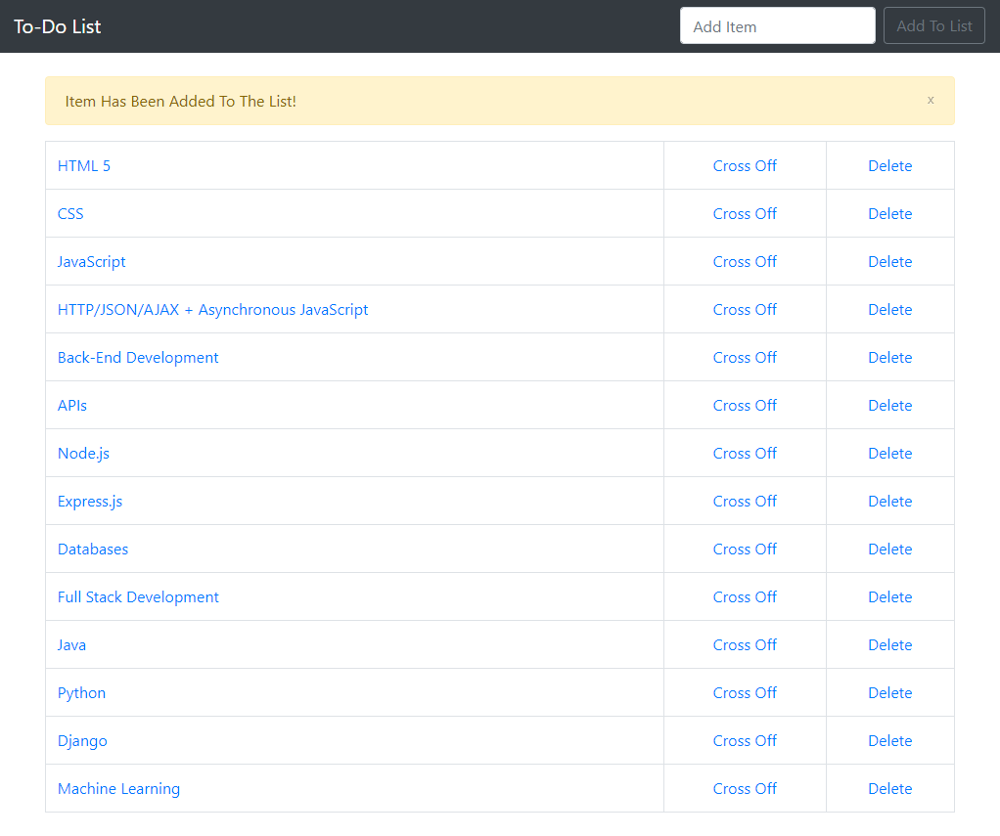
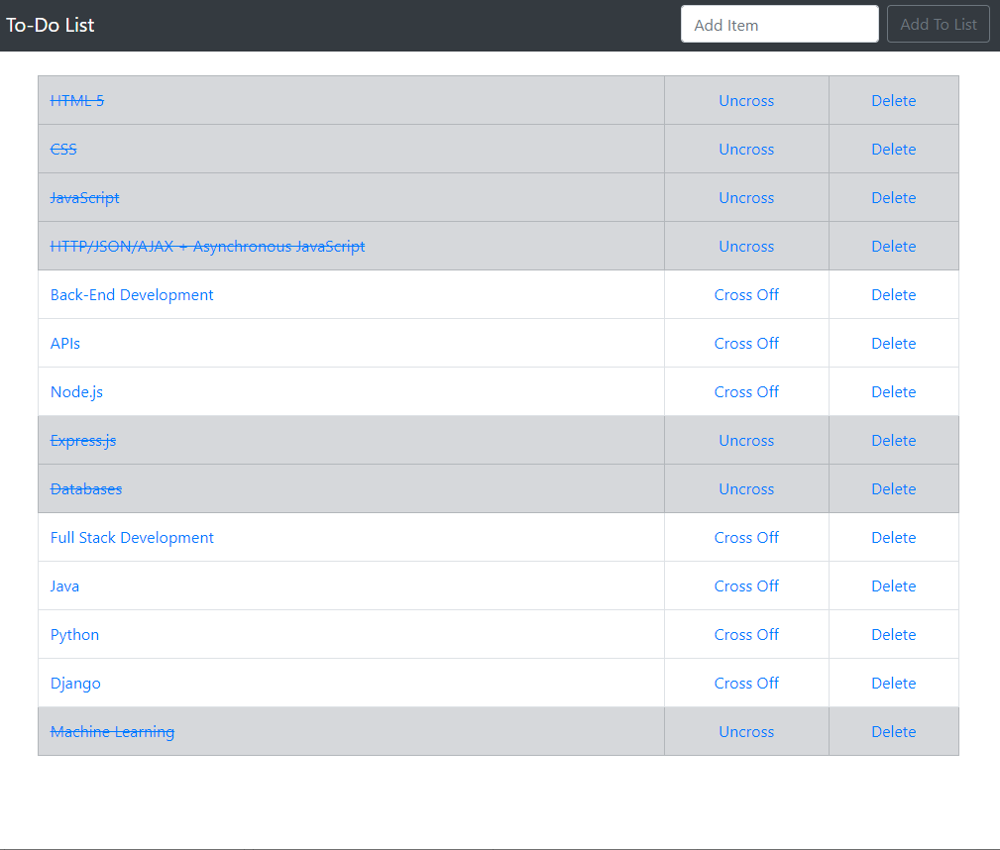

# To-Do-List-App
A simple To-Do list application using Django and Python

## Current Features and UI

    


## Local Development
### Requirements
 - [Python](https://www.python.org/downloads/)
 - [Django](https://www.djangoproject.com/)

```
# Install the dependencies needed
pip install django

# Start the app
cd "To-Do-List-App-master\django_app\todo" 
python manage.py runserver

```
